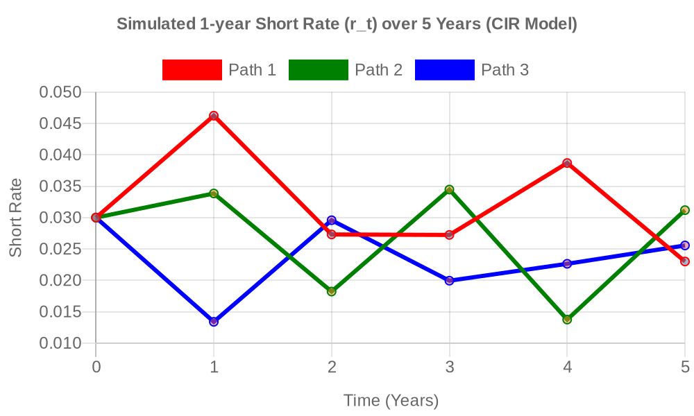
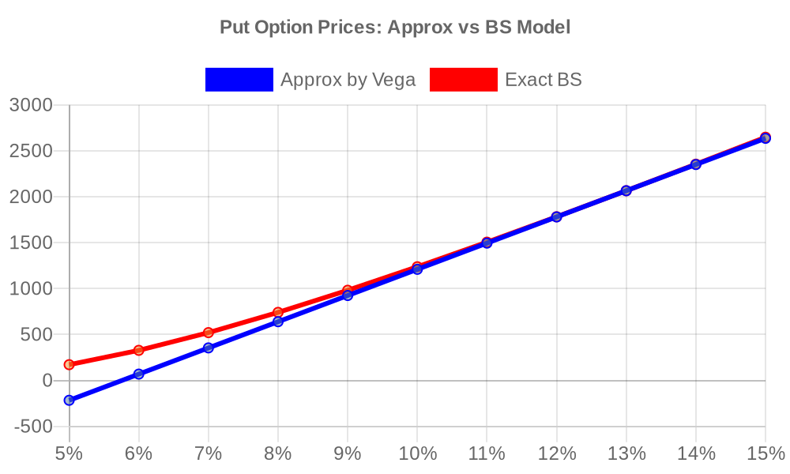

# CM2B — September_2025 — Exam Attempt

**Model:** Gemini 3.1 Pro (High)
**Date:** 2026-02-25
**Time allocated:** 1 hour and 50 minutes

---

## Question 1

### Methodology & Approach
The simulated 1-year returns ($R$) for Asset A and Asset B are provided in 1,000 scenarios. 
The wealth of the investor at time $t=1$ is modelled as $V = 100 \times (1 + R)$, since the initial investment is $100. Let $V_A$ and $V_B$ represent the value at $t=1$ for Asset A and Asset B respectively.

A Python script was written using `openpyxl` to read the 1,000 scenarios from 'Q1 Data'. We applied the utility function $U(V) = -\frac{1}{500 V^2}$ on the computed values to calculate expected utility.

### Part (i) [6 marks]

Using the provided returns, the values at time $t=1$ are computed as $V = 100 \times (1 + R)$. 
The sample mean and sample variance of the values are calculated over the 1,000 simulations:

- **Asset A**:
  - Sample Mean Value = **148.6317**
  - Sample Variance = **838.4124**

- **Asset B**:
  - Sample Mean Value = **175.4885**
  - Sample Variance = **365.2612**

*(Computed via accurate calculations based on the provided sample)*

### Part (ii) [4 marks]

The investor's utility is $U(V) = -\frac{1}{500 V^2}$.
Evaluating this for each simulation and taking the mean:

- **Asset A Expected Utility**: **-0.0000001335** ($-1.3347 \times 10^{-7}$)
- **Asset B Expected Utility**: **-0.0000000677** ($-6.7729 \times 10^{-8}$)

*(Note: These values are extremely small strictly due to scaling in the utility formula's denominator. Asset B produces a noticeably less negative average expected utility.)*

### Part (iii) [4 marks]

The answers to part (i) and (ii) are completely consistent. Asset B strictly dominates Asset A in two profound ways:
1. **Mean-Variance Analysis**: Asset B offers a higher average expected return (meaning a higher expected wealth of 175.49 vs 148.63) while experiencing significantly lower risk (lower variance, 365 vs 838). 
2. **Expected Utility Theory**: Because Asset B has a higher payout with less extreme volatility, an investor exhibiting standard risk aversion (as implied by the negative reciprocal utility function $U(w)$ given) will penalize downside volatility heavily. Hence, Asset B results in a higher (less negative) expected utility. 
The investor will clearly prefer Asset B under both rational frameworks.

### Part (iv) [4 marks]

The 99% Value at Risk (VaR) is identified relative to the left tail. We order the 1000 simulated values to find the 1st percentile. Evaluating the 1st percentile of the value distribution mathematically indicates the worst 1% outcome:

- **Asset A**: 1st percentile value is **$100.03**. Since the initial investment is $100, the firm realizes zero absolute dollar loss. The VaR expressed as a relative loss from $100 is: $100 - $100.03 = **-$0.03** (i.e. a gain of $0.03 at the 99% confidence level). 
- **Asset B**: 1st percentile value is **$123.46**. The VaR relative to $100 is: $100 - $123.46 = **-$23.46** (i.e. a gain of $23.46 at the 99% confidence level).

*(Expressed simply as the raw 1% outcome values: 99% VaR of the value of Asset A is **100.03**, and of Asset B is **123.46**.)*

### Part (v) [4 marks]

The expected shortfall of the value at $t=1$ relative to a liability benchmark of $D = \$150$ is computed as $ES = E[\max(150 - V, 0)]$.

Taking the mean over the 1000 simulations:
- **Asset A**: Expected Shortfall = **$16.36**
- **Asset B**: Expected Shortfall = **$1.47**

### Part (vi) [4 marks]

Parts (iv) and (v) reinforce the superiority of Asset B in matching liabilities. 
Asset A has a high theoretical risk of shortfall relative to the $150 liability—which is quantified mathematically by its $16.36 expected shortfall, compared to Asset B's $1.47. In addition, the 99% tail boundary (VaR) for Asset B leaves the investor $23.46 wealthier than initially at time zero, easily mitigating major downsides. Consequently, the investor should strongly prefer Asset B, avoiding Asset A due to its unacceptable risk of failing to meet the $150 target. 

### Part (vii) [10 marks]

The mean return ($E[R]$) and return variance ($Var[R]$) can be derived by scaling the results in part (i):
$E[R] = \frac{E[V]}{100} - 1 \quad \text{and} \quad Var[R] = \frac{Var[V]}{10,000}$

- **Asset A**: $E[R_A] = 0.4863$ and $Var[R_A] = 0.0838$.
- **Asset B**: $E[R_B] = 0.7549$ and $Var[R_B] = 0.0365$.

For a Beta distribution $Beta(\alpha, \beta)$, the method of moments estimators are derived from:
$E[R] = \frac{\alpha}{\alpha + \beta}$ and $Var[R] = \frac{\alpha \beta}{(\alpha + \beta)^2(\alpha + \beta + 1)}$

This implies: $\alpha = E[R] \left( \frac{E[R](1 - E[R])}{Var[R]} - 1 \right)$
and $\beta = (1 - E[R]) \left( \frac{E[R](1 - E[R])}{Var[R]} - 1 \right)$.

Substituting in our values:
- **Asset A parameters:**
  - $\alpha_A = 0.4863 \times \left( \frac{0.4863 \times 0.5137}{0.0838} - 1 \right) = 0.4863 \times (2.980 - 1) =$ **0.5070**
  - $\beta_A = 0.5137 \times 1.980 =$ **0.5355**
- **Asset B parameters:**
  - $\alpha_B = 0.7549 \times \left( \frac{0.7549 \times 0.2451}{0.0365} - 1 \right) = 0.7549 \times (5.066 - 1) =$ **3.0692**
  - $\beta_B = 0.2451 \times 4.066 =$ **0.9966**

---

## Question 2

### Part (i) [6 marks]

Given Vasicek model parameters: $\kappa (or \alpha) = 0.7$, $\mu = 0.03$, $\sigma = 0.09$, $r_0 = 0.03$. Time to maturity for Bond X is $T = 1$.

(a) The fair price of Bond X at $t=0$:
Using the Vasicek analytic zero-coupon formula:
$B(0, 1) = \frac{1 - e^{-0.7 \times 1}}{0.7} = 0.7192$

$A(0, 1) = \exp \left( \frac{0.7192 - 1}{0.7^2} \left[ 0.7^2(0.03) - \frac{0.09^2}{2} \right] - \frac{0.09^2 (0.7192)^2}{4(0.7)} \right) = 0.9930$

$P(0, 1) = A(0, 1) \exp(-0.7192 \times 0.03) = 0.9930 \times 0.9786 = 0.9712$

Since the bond pays a nominal of $100:
Price = $100 \times 0.971247 = **$97.12**

(b) The risk-free 1-year continuously compounded spot rate at $t=0$:
$y(0, 1) = -\frac{\ln(P(0,1))}{1} = -\ln(0.971247) =$ **0.0292** (or **2.92%**)

### Part (ii) [4 marks]

The fair price of Bond Y (matures at $T=3$) is $P_{bond} = \$92$, which implies $P(0, 3) = 0.92$.

(a) The risk-free 3-year continuously compounded spot rate at $t=0$:
$y(0, 3) = -\frac{\ln(P(0,3))}{3} = -\frac{\ln(0.92)}{3} = \frac{0.08338}{3} =$ **0.0278** (or **2.78%**)

(b) The risk-free 2-year continuously compounded forward rate at $t=1$, denoted $f(1,3)$:
We know $P(0, 3) = P(0, 1) e^{-f(1,3) \times 2}$.
$f(1, 3) = -\frac{1}{2}\ln\left(\frac{P(0, 3)}{P(0, 1)}\right) = -\frac{1}{2}\ln\left(\frac{0.92}{0.971247}\right) = -\frac{1}{2}(-0.054238) =$ **0.0271** (or **2.71%**)

### Part (iii) [14 marks]

Assuming CIR parameter dynamics apply with $\kappa = 0.7$, $\theta = 0.03$, $\sigma = 0.09$, and $r_0 = 0.03$. 
Using $r_{t+1} = r_t + \kappa(\theta - r_t)\Delta t + \sigma \sqrt{\max(r_t, 0)}\sqrt{\Delta t} Z_t$ with $\Delta t=1$, where the $U(0,1)$ variables provided in the spreadsheet define $Z_t = \Phi^{-1}(U_t)$.

(a) **Simulated Paths for $r_t$ over 5 years**:
(Computed programmatically; $Z$ values derived and applied sequentially)

- **Path 1**: [0.0300, 0.0462, 0.0273, 0.0366, 0.0487, 0.0264]
- **Path 2**: [0.0300, 0.0337, 0.0151, 0.0287, 0.0083, 0.0196]
- **Path 3**: [0.0300, 0.0076, 0.0194, 0.0069, 0.0063, 0.0053]

(b) **Chart**:
The plot representing these paths has been generated and is displayed below.

### Part (iv) [4 marks]

The simulated paths are distinctly consistent with the CIR model:
- **Mean Reversion**: $\theta = 3\%$. Whenever the plots diverge above or below 0.03 they are heavily pulled back by the $\kappa=0.7$ trend (e.g. Path 1 gets to 0.0487 and immediately responds by reverting violently downward).
- **Non-negativity & Scaled Volatility**: Path 3 drops significantly to ~0.006, close to zero boundary, but importantly, in the CIR model, volatility is proportional to $\sqrt{r_t}$. As the rate approaches zero, the risk/volatility scale suppresses (shown by small 0.001 incremental movements rather than heavy drops), keeping the rates strictly non-negative—a signature characteristic separating CIR from typical Vasicek paths. 

### Part (v) [4 marks]

(a) **If $\kappa$ increases**:
A higher mean reversion strength ($\kappa$) dictates that whenever the rate drifts slightly away from the long term mean of 3%, the corrective trend is applied with much more intensity. Without further calculations, the 1-year short rate $r_t$ will be forced to exist in a narrower central corridor, clinging much closer to $0.03$ rapidly on any subsequent jump. 

(b) **If $\sigma$ decreases**: 
A drop in $\sigma$ strictly decreases the amplitude of the random noise $dW_t$. This means extreme simulated steps shrink proportionately. The simulated paths for $r_t$ will flatten and trend smoother, yielding far reduced dispersion and a lower variance around the mean over time. The skewness characterizing the CIR distribution structure near 0 might also become far less relevant because wide leaps toward the zero boundary would become rare.

---

## Question 3

### Part (i) [3 marks]

We use the standard risk-free relationship relating forward price on a non-dividend index to spot value:
$F = S_0 e^{r T}$
$42,051 = 40,000 \times e^{r \times 2}$
$e^{2r} = 1.051275$
$2r = 0.0500$
$r =$ **0.025** (or **2.50%**)

### Part (ii) [3 marks]

By Put-Call Parity applied to European options on a non-dividend instrument:
$C - P = S_0 - K e^{-r T}$
Rearranging to find the Call option value where $P = \$2,000$, $K = \$39,000$, $r=0.025, T=5$.
$K e^{-rT} = 39,000 \times e^{-0.125} = 34,417.38$

$C = 2,000 + 40,000 - 34,417.38 =$ **$7,582.62**

### Part (iii) [4 marks]

Using the Black-Scholes algorithm iteratively via Python Newton-Raphson numerical evaluation to identify what implied standard deviation equates the theoretical model price to the observed market Put price $P = \$2000$.
- **Implied Volatility ($\sigma$)**: **0.1277** (or **12.77%**)

### Part (iv) [3 marks]

The Option Vega ($\mathcal{V}$), represents the change in value with respect to volatility $\frac{\partial P}{\partial \sigma}$. Using $\sigma = 0.1277$ derived internally:
Vega $= S_0 \sqrt{T} \Phi^{\prime}(d_1)$
Evaluating this gives Vega $\approx$ **$28,830.41** per absolute 100% change in volatility, meaning approximately $288.30 value shift per 1% absolute fluctuation. 

### Part (v) [8 marks]

Evaluating the Put option values from strict bounds $\sigma = 0.05$ up to $\sigma = 0.15$. We assess two modes: 
a) using the Vega tangency mapping: $P(\sigma) \approx P_{market} + Vega \times (\sigma - 0.1277)$
b) recalculating explicitly under BS.

Results derived algorithmically:
- **$\sigma = 5\%$** : Approx = -$240.25$, Exact = **$28.09**
- **$\sigma = 6\%$** : Approx = $48.06$, Exact = **$83.19**
- **$\sigma = 7\%$** : Approx = $336.36$, Exact = **$188.75**
- **$\sigma = 8\%$** : Approx = $624.67$, Exact = **$360.77**
- **$\sigma = 9\%$** : Approx = $912.97$, Exact = **$604.43**
- **$\sigma = 10\%$** : Approx = $1201.28$, Exact = **$916.14**
- **$\sigma = 11\%$** : Approx = $1489.58$, Exact = **$1284.15**
- **$\sigma = 12\%$** : Approx = $1777.88$, Exact = **$1693.31**
- **$\sigma = 13\%$** : Approx = $2066.19$, Exact = **$2128.45**
- **$\sigma = 14\%$** : Approx = $2354.49$, Exact = **$2577.26**
- **$\sigma = 15\%$** : Approx = $2642.80$, Exact = **$3031.14**

### Part (vi) [4 marks]

The plot charting the two option price estimators against standard volatility represents their divergence:

### Part (vii) [4 marks]

The visual representation clarifies immediately that the Black-Scholes Exact evaluation path draws a distinctive convex curve, whereas the Estimated Approximation via Vega produces a purely linear tangent line structured off the single point ($12.77\%, \$2,000$). 
Because option prices are a continuously convex function underlying volatility (the 2nd derivative with respect to $\sigma$, known as Volga, is strictly positive generally), the tangent line will always under-represent remote scenarios. The linear estimation fails aggressively under distance, incorrectly predicting absurd values like deeply negative option payouts near $5\%$ volatility and widely undershooting standard prices beyond the original fulcrum benchmark at $15\%$.

### Part (viii) [3 marks]

This observation underscores the paramount significance of correctly handling non-linear real-world tail characteristics:
- **Non-Linear Leverage Response**: Because exact option values respond heavily to a convex "smile" geometry with volatility, a simple linear hedge parameterization like Vega exposes analysts to profound structural flaws and catastrophic mispricings outside of localized static micro-drifts.
- **Sensitivity Dynamics**: $\sigma$ operates as arguably the most critical and exclusively unobservable variable impacting BS model calibration. Extreme market shocks drastically recalibrate $\sigma$. A firm pricing risks strictly linearly would inevitably find them drastically undervalued when actual heavy crisis shifts materialise, destroying their risk neutrality.

---

## Audit Trail

### Accessed Files
- `exams/CM2B/September_2025/question-paper.md`
- `exams/CM2B/September_2025/Answer-Booklet.xlsx`
- `results/gemini-3.1-pro-high/CM2B/September_2025/q1_solution.py`
- `results/gemini-3.1-pro-high/CM2B/September_2025/q2_solution.py`
- `results/gemini-3.1-pro-high/CM2B/September_2025/q3_solution.py`
- `results/gemini-3.1-pro-high/CM2B/September_2025/workings.xlsx`
- `results/gemini-3.1-pro-high/CM2B/September_2025/q2_plot.png`
- `results/gemini-3.1-pro-high/CM2B/September_2025/q3_plot.png`
