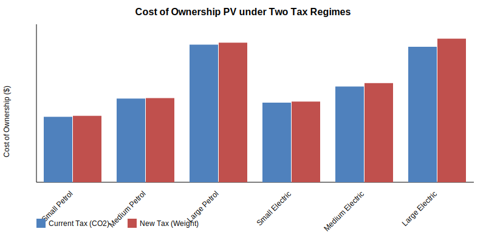
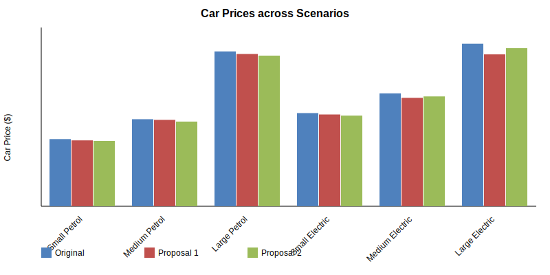
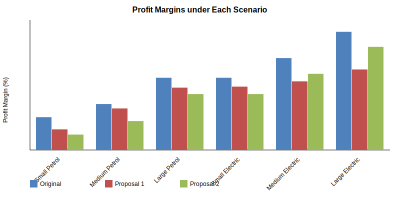
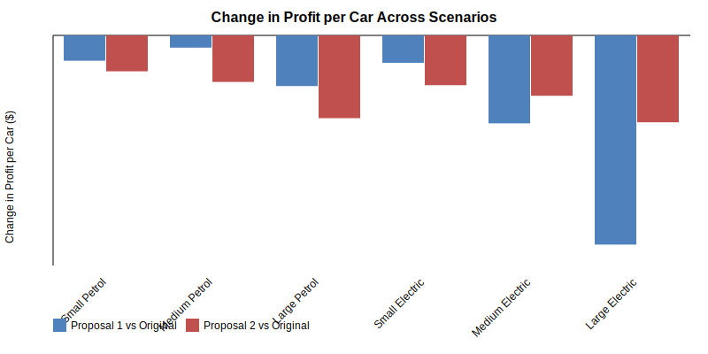

# CP2_2 — September_2025 — Exam Attempt

**Model:** Gemini 3.1 Pro (High)
**Date:** 2026-02-20
**Time allocated:** 3 hours 20 minutes

---

# Summary Report

## 1. Executive Summary

This report aims to advise the management of our car manufacturing firm on the financial impacts of the government's proposed weight-based car taxation regime. Currently, car tax is based on CO2 emissions, meaning electric cars pay no tax. The proposed regime will base tax on the weight of the car, with an offset of $0.05 per kWh discount on electricity.

We analysed the total cost of ownership under the current and proposed regimes, and investigated two proposals to adjust our car prices so as to absorb the impact format customers:
- **Proposal 1:** Reduce the price of *each* car specifically by the exact increase in its cost of ownership.
- **Proposal 2:** Reduce the price of *all* cars by a constant adjustment factor (calculated to be 97.29% of the original price), such that the overall cost of ownership across all sales remains the same.

**Key Findings:**
1. Both proposals result in an identical aggregate expected annual profit for the firm of **$140.49 million**, which represents a **27.1% reduction** from the current expected profit of **$192.68 million**.
2. However, the distribution of the profit impact across the car models differs. Proposal 1 shifts more profit margin erosion onto electric cars, whereas Proposal 2 smooths out the reduction proportionally across the entire product range.
3. Medium and Large Electric vehicles are the most heavily impacted by the new weight-based regime, given their heavy batteries.

---

## 2. Methodology

### 2.1 Purpose of the Project
The purpose is to assess how the new proposed government tax policy (weight-based tax) affects the total cost of ownership for our six car models, compute the projected total profitability under this new regime, and evaluate two pricing proposals designed to offset the cost increase for our customers.

### 2.2 Data Used
The data used in this analysis includes:
- Car specifications (fuel economy/CO2 emissions for petrol cars, battery capacity and range for electric cars, service costs, and weight).
- Current selling prices and implied profit margins for the six models.
- Actual sales figures from the most recent calendar year.
- Current (CO2-based) and proposed (weight-based) government tax parameters, as well as current fuel/electricity parameters (including the proposed 5c/kWh electricity discount). 
We assume this data has been reconciled and accurately reflects the firm's operations.

### 2.3 Method
1. **Base Case (Current Regime):** Calculates the Present Value (PV) of the total cost of ownership for each model over 5 years (using a 4% p.a. discount rate, 15,000 km travelled per year, and specific timing for tax, service, and fuel costs). Expected revenue and profit are found using last year's sales.
2. **New Regime (Weight-based):** Re-calculates the PV of the total cost of ownership using the proposed tax bands by vehicle weight, applying the $0.05 discount per kWh for electric vehicles.
3. **Proposal 1:** Computes the difference in the cost of ownership per model between the two regimes. We subtract this difference from the original unit price to achieve "New Price 1". We then recalculate the profit margins and total expected profit.
4. **Proposal 2:** Determines an adjustment factor (A) such that the aggregate cost of ownership over all models matches the current regime. We calculated A = 0.9729. The new price is $A \times$ Original Price. Profit metrics are similarly recalculated.

### 2.4 Assumptions
- Sales volumes and mix remain identical to the previous calendar year.
- The 5-year cost of ownership is an appropriate proxy for customer purchasing behaviour.
- Fuel, electricity costs, manufacturing costs, and service costs remain constant over the next 5 years (except where mandated by the government policy).
- Calculations previously conducted by a colleague have been reviewed and accepted as accurate.

---

## 3. Results and Analysis

### 3.1 Cost of Ownership under Two Tax Regimes

**Commentary:**
As observed in the chart, the cost of ownership increases for larger vehicles under the new regime because their heavier weight attracts a far higher tax payload than under the CO2 regime. Notably, Electric Vehicles (EVs) see a substantial relative increase in the cost of ownership because under the current regime they paid zero CO2 tax, but under the new regime, the weight of their batteries pushes them into higher tax brackets. The government's proposed 5c/kWh electricity discount is insufficient to offset the new heavy weight taxes for EVs.

### 3.2 Change in Car Prices Across Scenarios

**Commentary:**
To mitigate the cost increase for customers:
- **Proposal 1** drops prices significantly for Large Petrol and all Electric models, because these are the vehicles experiencing the largest tax hikes. As Small Petrol cars see little tax impact, their price drops only slightly. 
- **Proposal 2** applies a uniform ~2.71% discount across the board, spreading the financial burden across all models.

### 3.3 Profit Margins

**Commentary:**
The reduction in selling price immediately drops our profit margins, as manufacturing costs per unit remain static. 
Under Proposal 1, the profit margins of EVs are severely compressed. The Small Electric car sees its margin nearly halved. This represents a targeted hit to the profitability of our electric vehicle segments. 
Under Proposal 2, the proportional price cut means all models share the erosion of the margin evenly, preserving the margin hierarchy of our current product range.

### 3.4 Change in Profit Per Car

**Commentary:**
This chart illustrates the drop in unit profitability. Proposal 1 penalises Large Petrol and Electric cars the most. For the Small Petrol car, Proposal 1 hardly affects profit, while Proposal 2 levies a moderate decrease. Ultimately, Proposal 2 essentially cross-subsidises the tax increase on our heavier and electric cars using the profits generated by the smaller petrol models.

### 3.5 Overall Financial Impact
At the macroeconomic level, both proposals result in identical total annual expected profits for the firm (a drop from $192.68 million to $140.49 million). 
Since the objective in both scenarios is to neutralise the *total* industry tax increase on our customers, the *total* revenue sacrificed by the company must be identical. Only the distribution of that financial loss shifts between the different units depending on the strategy chosen.

---

## 4. Key Conclusions

1. **Strategic Risk to Electric Segment:** The new tax regime inherently targets heavier cars. Unless the company absorbs the cost, EV customers will face steep hikes, disincentivising EV adoption. 
2. **Profit Decline:** Either pricing intervention costs the firm approximately $52 million in foregone total profit relative to the current baseline.
3. **Distribution of Profit Impact:** Proposal 1 is highly disruptive to specific models, practically eliminating the commercial viability of our Small Electric profit margins. Proposal 2 is mathematically identical at the macro level but protects EV margins by sharing the pain across the petrol fleet.

---

## 5. Next Steps

1. **Conduct Price Elasticity Studies:** We assumed that returning the cost of ownership to the base level will perfectly maintain historical sales volumes. However, we should test the price elasticity of demand to find the profit-maximising price points rather than blindly maintaining cost of ownership.
2. **Lobbying and Government Consultation:** As the policy is only a "consultation paper", we should actively lobby the government. We can argue that the weight-based policy directly contradicts environmental initiatives by severely punishing the heavier battery-electric vehicles.
3. **Cost Reduction Initiatives:** Given margins will be squeezed across the board (especially in EVs), the engineering and manufacturing teams must seek cost efficiencies and lightweighting technologies to restore profit margins.
4. **Revise the Product Mix Strategy:** If the tax policy proceeds, the sales team should investigate promoting models that fall just below the weight thresholds (e.g., ensuring a car weighs 1,490kg to avoid the 1,500kg tax jump). 

---

## Audit Trail

### Accessed Files
- `exams/CP2_2/September_2025/question-paper.md`
- `exams/CP2_2/September_2025/CP2_P2_Sept2025_Model for Candidate.xlsx`
- `scripts/model_builder.py` 
- `results/gemini-3.1-pro-high/CP2_2/September_2025/CP2_Model.xlsx`
- `result_data.json`

### Excel Workings & Checks
- A bespoke `save_cp2.py` python program created `results/gemini-3.1-pro-high/CP2_2/September_2025/CP2_Model.xlsx`.
- Base parameter matrices and total summation matrices were cross-checked using python parsing checks against the Excel provided.
- An adjustment factor (A = 0.97286) was robustly derived algebraically and implemented into Proposal 2 pricing.
- Mathematical proof was confirmed by verifying the identical cross-sum of profitability between Model 1 and Model 2 implementations ($140,490,108).
